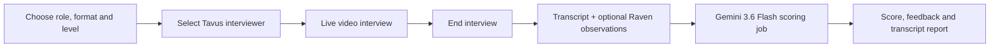
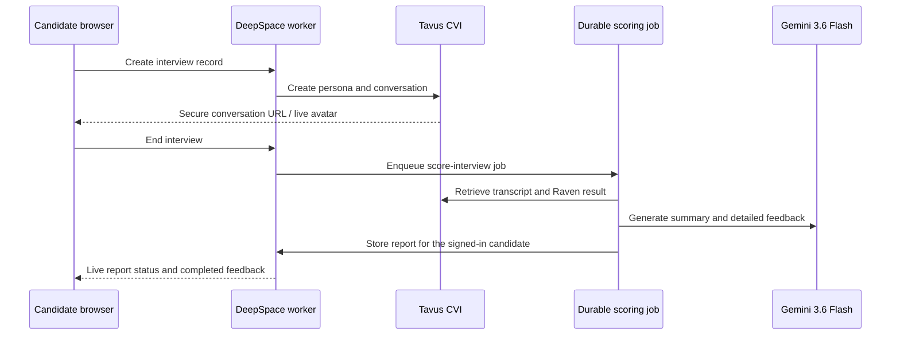

# Dialogue — AI Mock Interview Platform

[](https://dialogue-interview-neel.app.space)

Dialogue is a browser-based mock-interview platform for interview practice and coaching. A candidate selects a target role, interview format, seniority level, and optional job description; then practices with a live conversational video interviewer and receives structured feedback after the call.

**Live application:** [dialogue-interview-neel.app.space](https://dialogue-interview-neel.app.space)

<p align="center">
  <a href="https://www.tavus.io/" title="Tavus">
    
  </a>
</p>

> The visual above is served from the [official Tavus website](https://www.tavus.io/) and remains Tavus property. It illustrates the conversational-video technology used by the project.

## Product flow



### What candidates can do

- Choose behavioral, coding, or system-design interview formats.
- Tailor an interview to a role, seniority level, and job description.
- Select a Tavus video interviewer avatar.
- Complete a real-time conversational video interview with follow-up questions.
- Review a score, answer-by-answer feedback, strengths, improvement areas, and transcript after the call.
- Return to prior interview reports from their personal history.

## Technology overview

| Layer | Responsibility |
| --- | --- |
| **React + Vite** | Candidate-facing interview setup, live-call stage, report view, and history UI. |
| **DeepSpace + Cloudflare Workers** | Authentication, real-time records, role-based access control, durable background jobs, and deployment. |
| **Tavus Conversational Video Interface** | Video interviewer replica, persona, conversation room, captions, and interview transcript. |
| **Tavus Raven** | Optional end-of-call camera and delivery observations used as coaching context. |
| **Gemini 3.6 Flash** | Server-side fast summary and detailed report generation from the completed interview transcript. |

## Architecture



## Feedback model

The scoring job runs after the call ends. It waits for the Tavus transcript, then generates:

- an immediate headline score and short summary;
- a detailed per-question breakdown with suggested stronger answers;
- strengths and practical areas to improve;
- optional camera and delivery coaching when Tavus Raven returns an observation.

Raven observations are intentionally framed as limited, actionable coaching. They are not used to infer personality, health, protected traits, or hiring suitability. Dialogue is a practice tool and should not be used as an automated employment decision system.

## Run locally

```sh
npm install
npx deepspace login
npx deepspace dev
```

The server requires these secrets, stored outside source control:

```text
TAVUS_API_KEY=...
GOOGLE_GENERATIVE_AI_API_KEY=...
```

Never place credentials in browser code, commits, or the README. DeepSpace loads them as server-side bindings for the Cloudflare Worker.

## Deploy

```sh
npx deepspace deploy
```

The deployed subdomain is set by `name` in [`wrangler.toml`](./wrangler.toml). The current production target is [dialogue-interview-neel.app.space](https://dialogue-interview-neel.app.space).

## Repository notes

This repository contains the application source and its Git history. External platforms used by the application are credited above; their trademarks, media, and API services remain their respective owners.
